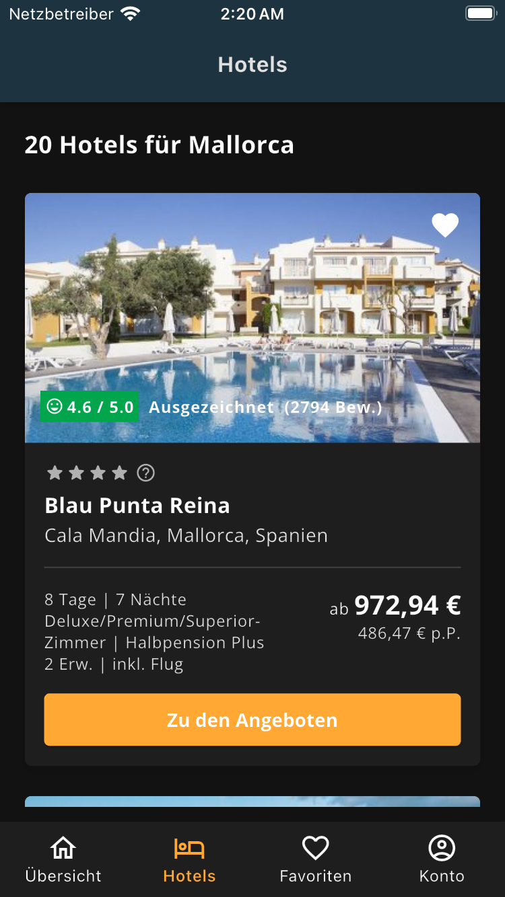

# Invia Hotel Booking App

This project was developed as part of an Invia interview assignment to demonstrate proficiency in Flutter development, clean architecture principles, and best practices. The app showcases a hotel booking interface with a bottom navigation bar featuring four tabs: Overview, Hotels, Favorites, and Account. It implements state management with BLoC pattern, efficient navigation, persistent storage, and comprehensive test coverage.

The primary goal of this project is to demonstrate technical expertise in:
- Clean architecture implementation
- Effective state management using the BLoC pattern
- Type-safe navigation with deep linking
- Local storage for favorites and settings
- Comprehensive testing with 97% code coverage
- Multilingual support and theming capabilities

## Table of Contents

- [Screenshots](#screenshots)
- [Features](#features)
- [Architecture](#architecture)
- [Project Structure](#project-structure)
- [State Management](#state-management)
- [Navigation](#navigation)
- [Local Storage](#local-storage)
- [Testing](#testing)
- [Additional Features](#additional-features)
- [Setup Instructions](#setup-instructions)

## Screenshots

<div align="center">
  <div style="display: flex; flex-direction: row; flex-wrap: wrap; justify-content: center; gap: 10px;">
    
    
    
    
  </div>
  <p>Screenshots showing Hotels and Favorites tabs in light and dark themes (German language)</p>
</div>

## Features

### Core Functionality
- Bottom navigation with four tabs: Overview, Hotels, Favorites, and Account
- Hotel listings with dynamic data fetched from API
- Loading states with spinner while fetching data
- Error handling with retry mechanism
- Favorite system to add/remove hotels
- Localization support for 5 languages: English, German, French, Spanish, and Italian
- Theme switching (light/dark/system)

### Hotel Tab
- Displays hotel cards with detailed information
- Shows loading spinner while fetching data
- Error screen with retry option when API call fails
- API integration with https://dkndmolrswy7b.cloudfront.net/hotels.json

### Favorites Tab
- Displays user's favorite hotels stored locally
- Toggle favorite by tapping the heart icon
- Remove hotels from favorites list
- Empty state when no favorites are saved

### Account Tab
- Theme selection (Light, Dark, System)
- Language selection (EN, DE, FR, ES, IT)

## Architecture

The project follows Clean Architecture principles with a clear separation of concerns through distinct layers:

### Layers
1. **Presentation**: UI components, screens, and BLoC/Cubit for state management
2. **Domain**: Business logic, use cases, and repository interfaces
3. **Data**: Data sources, repository implementations, and models

The architecture implements a clean separation of concerns, with data flowing from the API through the layers to the UI, and user actions flowing in the opposite direction.

### Folder Structure
- `lib/core`: Shared functionality across the app
- `lib/features`: Feature-specific modules (hotels, favorites, account)
- `lib/di`: Dependency injection setup
- `lib/l10n`: Localization resources

## Project Structure

```
lib/
├── core/
│   ├── api/                  # API client and interceptors
│   ├── constants/            # App-wide constants
│   ├── data/                 # Data models
│   ├── domain/               # Domain entities
│   ├── error/                # Exception handling
│   ├── extensions/           # Extension methods
│   ├── failure/              # Failure classes for domain layer
│   ├── locale/               # Locale management
│   ├── network/              # Network connectivity checking
│   ├── router/               # Navigation routing
│   ├── services/             # App-wide services
│   ├── theme/                # Theme configuration
│   ├── types/                # Custom types and enums
│   ├── usecases/             # Base usecase interfaces
│   ├── utils/                # Utility functions
│   └── widgets/              # Reusable widgets
├── di/                       # Dependency injection
├── features/                 # App features
│   ├── account/              # Account tab
│   ├── favorites/            # Favorites tab
│   ├── hotels/               # Hotels tab
│   └── overview/             # Overview tab
├── l10n/                     # Localization
└── main.dart                 # App entry point
```

## State Management

The app uses the BLoC pattern via the `flutter_bloc` package for state management:

- **HotelsCubit**: Manages fetching and displaying hotel data
- **FavoritesCubit**: Manages favorite hotels data and operations
- **ThemeCubit**: Manages app theme state and persistence
- **LocaleCubit**: Manages app language state and persistence

These Cubits are provided at the app level for global state access.

## Navigation

Navigation is implemented using `auto_route` package for type-safe routing:

- Configured with a bottom tab navigator
- Route guards for protected routes

### Deep Linking

The app supports deep linking, allowing users to directly open specific sections:

```
inviatest://hotelbooking/overview   # Opens the Overview tab
inviatest://hotelbooking/hotels     # Opens the Hotels tab
inviatest://hotelbooking/favorites  # Opens the Favorites tab
inviatest://hotelbooking/account    # Opens the Account tab
```

This implementation enables:
- Direct access to specific content from external sources
- Integration with other apps or web links
- Better user experience by reducing navigation steps

## Local Storage

Local storage is implemented using `Hive` for efficient, lightweight persistence:

- **Favorites**: Stored in a Hive box for offline access
- **Settings**: Theme and language preferences stored and retrieved using `hydrated_bloc`

## Testing

The app has extensive test coverage including:

### Unit Tests
- Core utilities, extensions, and helpers
- Repository implementations
- Use cases

### Widget Tests
- UI components and widgets
- Screen-level testing

### Bloc Tests
- State management testing
- Business logic validation

### Test Coverage
- Run tests with coverage using `flutter test --coverage`
- Actual test coverage: **97.0%** overall line coverage
- Custom script for filtering coverage metrics in `/scripts/test_coverage.sh`

#### Detailed Test Coverage Report
| Directory | Line Coverage |
|-----------|--------------|
| core/api/ | 100.0% |
| core/extensions/ | 100.0% |
| core/locale/ | 100.0% |
| core/network/ | 100.0% |
| core/theme/ | 100.0% |
| core/theme/cubit/ | 100.0% |
| core/utils/ | 100.0% |
| core/widgets/hotel_card/ | 90.5% |
| core/widgets/hotel_card/hotel_details/ | 100.0% |
| core/widgets/hotel_card/hotel_price_overview/ | 100.0% |
| core/widgets/hotel_card/rating/ | 100.0% |
| features/favorites/data/datasources/ | 100.0% |
| features/favorites/data/repositories/ | 100.0% |
| features/favorites/domain/usecases/ | 100.0% |
| features/favorites/presentation/cubits/ | 100.0% |
| features/favorites/presentation/view/ | 100.0% |
| features/hotels/data/datasources/ | 95.0% |
| features/hotels/data/repositories/ | 100.0% |
| features/hotels/domain/usecases/ | 100.0% |
| features/hotels/presentation/cubits/ | 100.0% |
| features/hotels/presentation/view/ | 93.0% |
| features/hotels/presentation/view/widgets/ | 100.0% |

This high level of test coverage ensures the app is reliable and maintainable, with comprehensive testing across all critical components.

## Additional Features

### Localization
- Support for 5 languages (EN, DE, FR, ES, IT)
- Localized texts for all UI elements
- Right-to-left (RTL) support where applicable

### Responsive Design
- Adaptive layouts for different screen sizes
- Support for both portrait and landscape orientations
- Tablet-optimized layouts

### Error Handling
- Robust error handling throughout the app
- Graceful degradation when network is unavailable
- User-friendly error messages and retry options

## Setup Instructions

## Flutter & Dart Versions
This project was developed using:
- **Flutter Version**: 3.29.2
- **Dart Version**: 3.7.2

To ensure proper functionality, it's recommended to use the same or newer Flutter and Dart versions when running the project.

1. **Clone the repository**
   ```
   git clone https://github.com/mpmnath/invia_hotel_booking.git
   cd invia_hotel_booking
   ```

2. **Install dependencies**
   ```
   flutter pub get
   ```

3. **Build generated files**
   ```
   dart run build_runner build --delete-conflicting-outputs
   ```

4. **Run the app**
   ```
   flutter run
   ```

5. **Run tests**
   ```
   flutter test
   ```

6. **Run tests with coverage**
   ```
   sh /scripts/test_coverage.sh
   ```

## Key Design Decisions

### State Management
- Chose BLoC/Cubit for predictable and testable state management
- Implemented hydrated BLoC for persisting state for theme and locale

### Architecture
- Followed clean architecture for better separation of concerns
- Used repository pattern to abstract data sources

### Performance Optimizations
- Cached network images for faster loading
- Used lazy loading for hotel list
- Used compute to parse large JSON data
- Implemented efficient favorites toggle with minimal rebuilds

### Testing Strategy
- Comprehensive unit testing for business logic
- Widget testing for UI components
- Integration testing for critical user flows